# 🏋️‍♀️ FitMate - AI-Powered Personal Fitness Coach

**FitMate** is a SwiftUI 6-based iOS application designed for beginner gym users and individuals experiencing social anxiety. It combines personalized fitness tracking with a custom-trained AI assistant to support users in their workout, diet, and wellness journey.

---

## 📱 Features

- 🧠 **Smart Chatbot** – Ask questions about training, nutrition, and injury recovery (OpenAI & custom models)
- 🏃‍♀️ **Daily Tracking** – Monitor steps, calorie intake, sleep, and protein goals
- 📅 **Workout & Diet Plans** – Plan weekly routines and track daily entries
- 📷 **Gym Equipment Recognition** – Upload equipment photos and receive descriptions & usage tips
- 📊 **Progress Analytics** – Visual summaries: top-used program, weekly sets, progress charts, etc.
- 🧩 **Smart Suggestions** – Context-aware AI suggestions (e.g., setStepGoal, setCalorieGoal, setWorkoutProgram)
- 🔒 **Custom AI Model** – Optional LoRA fine-tuned Mistral-7B for offline use (fitness data in English)

---

## 🧠 AI Integration

### OpenAI (GPT-4o)
- Function calling support
- JSON-based suggestions for in-app actions
- Vision API for gym equipment image analysis

### Custom Model (LoRA Fine-Tuned Mistral-7B)
- Trained on:
  - `stackexchange_fitness`
  - `mental_health_and_fitness_data`
- Uses PEFT + Bitsandbytes for low-resource training
- Hosted via FastAPI + Colab + ngrok

---

## 🛠️ Tech Stack

| Component       | Tech Used                     |
|----------------|-------------------------------|
| Language        | Swift 5.10 / SwiftUI 6        |
| Backend         | Firebase Auth & Firestore     |
| AI Platform     | OpenAI API + LoRA/Mistral     |
| Dependency Injection | Swinject               |
| State Management| `@Observable`, `.environment()` |
| Architecture    | MVVM + Async/Await            |

---

## 📷 Screenshots

| **🏠 Home** | **🏠 Home** |
|:--:|:--:|
| 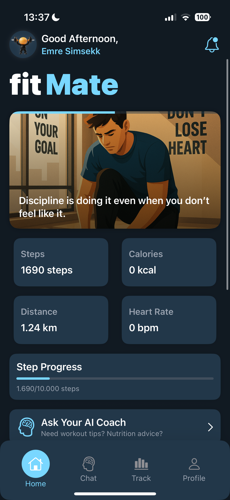 |  |

| **💬 Chat** | **💬 Chat** | **💬 Chat** |
|:--:|:--:|:--:|
| 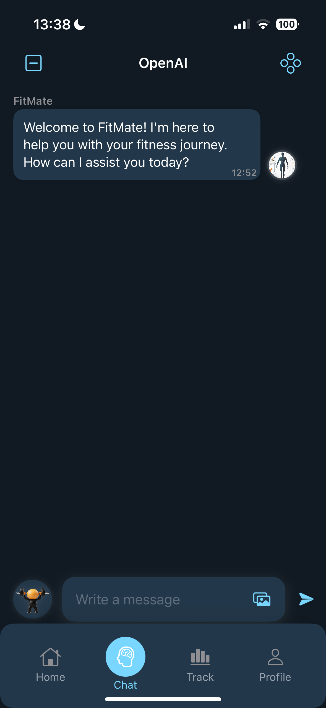 | 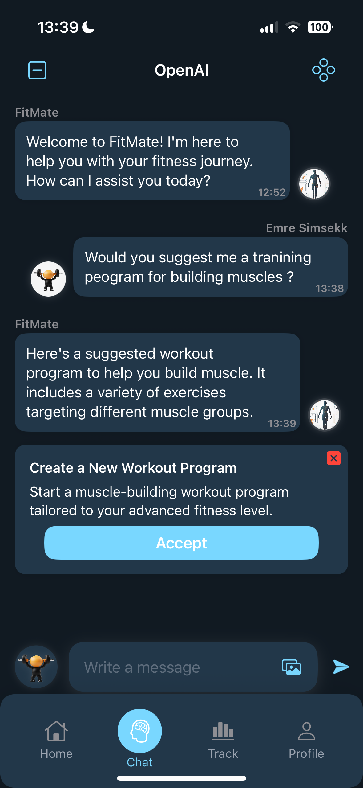 |  |

| **🏋️ Workout** | **🏋️ Workout** | **🏋️ Workout** |
|:--:|:--:|:--:|
| 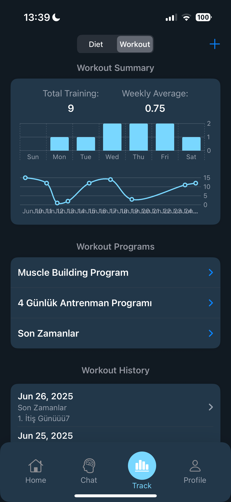 | 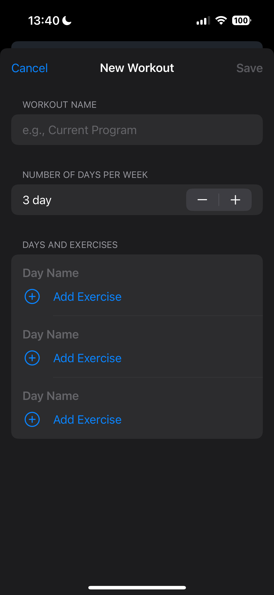 | 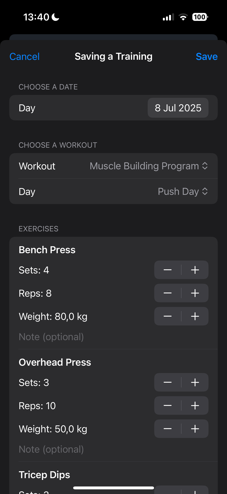 |

| **🥗 Diet** | **🥗 Diet** | **🥗 Diet** |
|:--:|:--:|:--:|
| 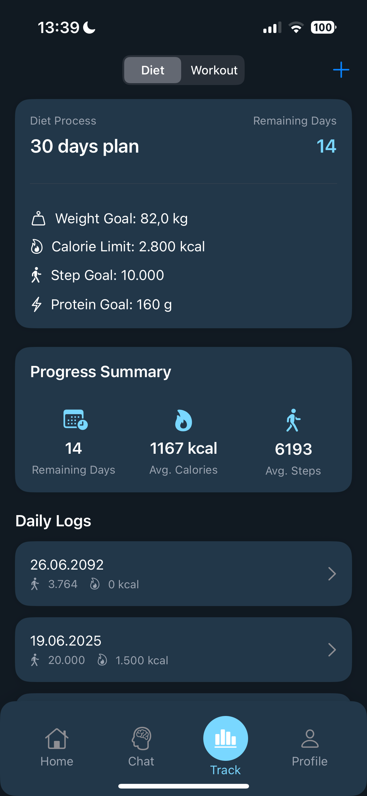 | 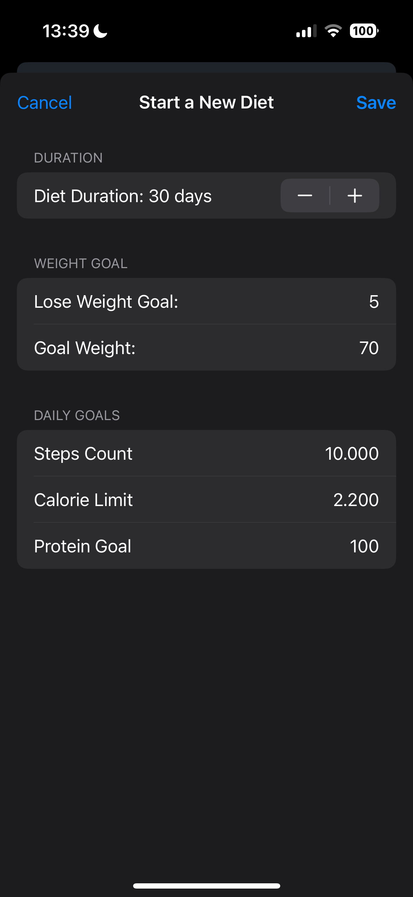 | 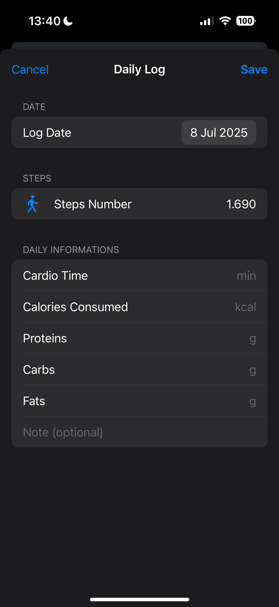 |

| **👤 Profile** | **👤 Profile** | **👤 Profile** | **👤 Profile** |
|:--:|:--:|:--:|:--:|
| 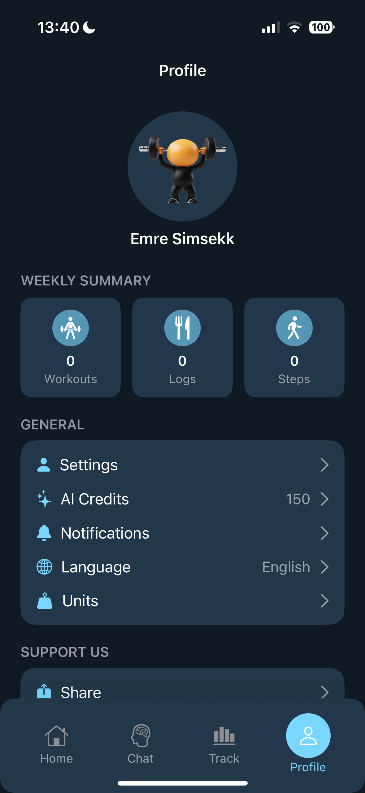 | 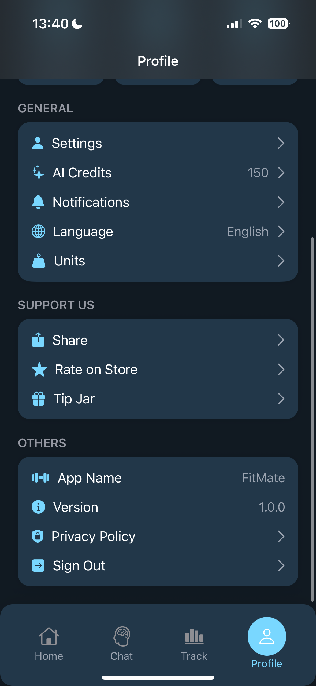 | 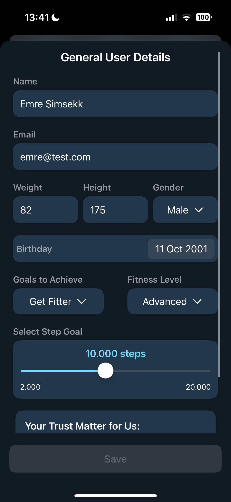 | 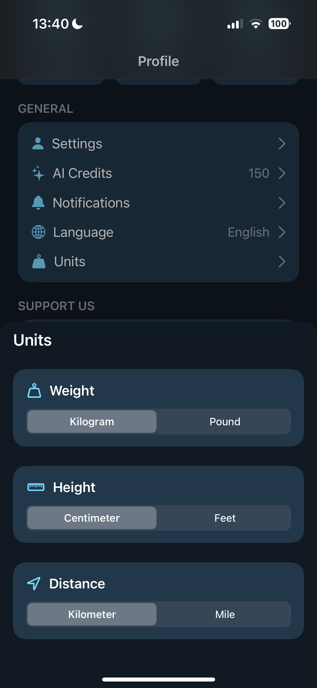 |

| **🔐 Authentication** | **🔐 Authentication** |
|:--:|:--:|
| 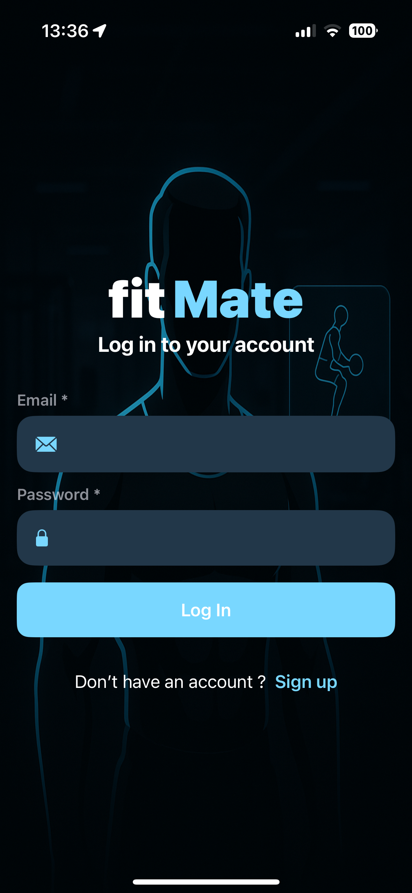 | 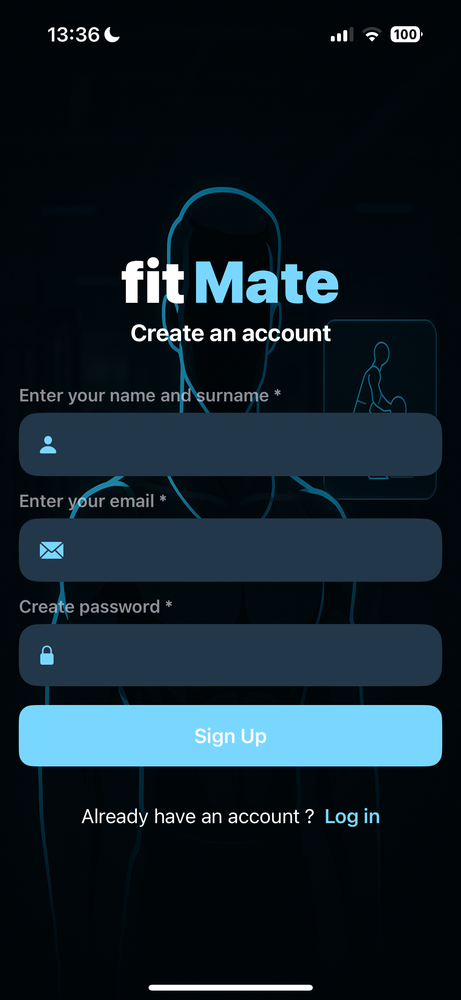 |

---

## 📎 License

This project is developed as a university thesis project and is open to educational use.

---

